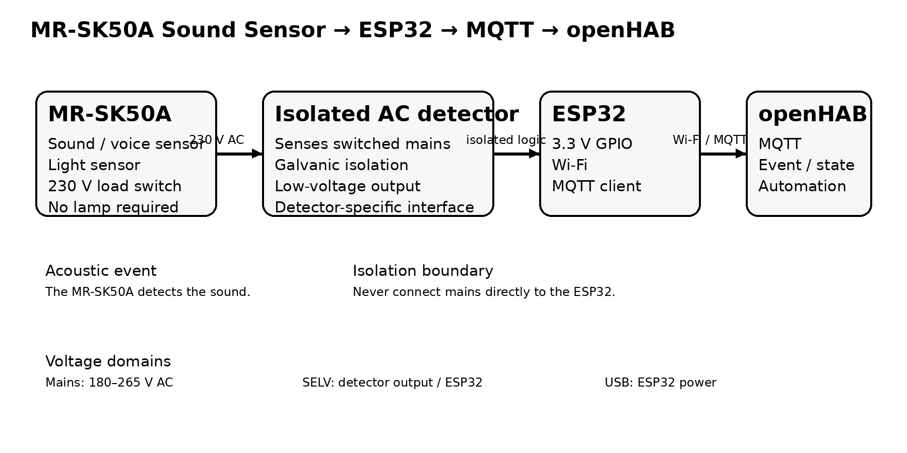

# MR-SK50A MQTT

**MR-SK50A Sound Sensor → ESP32 → MQTT → openHAB**

This project uses the **MR-SK50A acoustic/sound sensor switch** as a sound-event detector.

The MR-SK50A is normally used to switch a 230 V lamp when it detects a sound in darkness. In this project, **no lamp is used**. Instead, the 230 V output of the MR-SK50A is connected to a **galvanically isolated AC presence detector**. The isolated detector provides a safe low-voltage logic signal to an ESP32.

The ESP32 publishes the detected event via MQTT to openHAB.

## Concept

```text
             acoustic event
                    │
                    ▼
             ┌─────────────┐
             │  MR-SK50A   │
             │ sound +     │
             │ light sensor│
             └──────┬──────┘
                    │ switched 230 V AC
                    ▼
       ┌──────────────────────────┐
       │ Galvanically isolated    │
       │ AC presence detector     │
       └────────────┬─────────────┘
                    │ SELV logic
                    ▼
              ┌──────────┐
              │  ESP32   │
              └────┬─────┘
                   │ Wi-Fi
                   ▼
                MQTT broker
                   │
                   ▼
                openHAB
```



## Important: what detects the sound?

The **MR-SK50A detects the sound**.

The ESP32 does **not** contain a microphone and does not detect the sound directly. It only observes the MR-SK50A's switched output.

The signal chain is therefore:

**Sound → MR-SK50A → 230 V switched output → isolated detector → ESP32 → MQTT → openHAB**

## Hardware

### Required

- MR-SK50A sound/voice sensor switch
- ESP32 development board
- USB power supply for the ESP32
- Wi-Fi network
- MQTT broker
- openHAB
- **Galvanically isolated AC presence detector**, rated for the actual mains voltage and providing a documented low-voltage logic output compatible with the ESP32
- Suitable mains-rated enclosure, terminals and wiring

### Optional

- Status LED
- DIN-rail enclosure
- Fuse/protection appropriate for the installation
- Separate low-voltage enclosure for the ESP32

## Electrical safety

**230 V AC is lethal.**

Only qualified/competent persons should perform mains wiring.

- Never connect 230 V directly to an ESP32 GPIO.
- Use a properly rated, galvanically isolated AC detector.
- Do not use a breadboard for exposed mains wiring.
- Keep mains and SELV/low-voltage wiring physically separated.
- Use an appropriate enclosure, strain relief and terminals.
- Verify the exact terminal markings of the MR-SK50A you own before wiring.
- Do not rely on wire colours alone.
- Verify that the selected AC detector is suitable as the load connected to the MR-SK50A output.
- The MR-SK50A documentation commonly specifies a maximum load around 40 W; this does **not** mean every arbitrary load is automatically suitable.
- Disconnect mains power before working on the wiring.

See [docs/wiring.md](docs/wiring.md).

## Voltage domains

There are three separate electrical domains:

| Section | Typical voltage | Purpose |
|---|---:|---|
| MR-SK50A supply | 180–265 V AC | Powers the sound sensor |
| MR-SK50A switched output | mains AC | Indicates that the sensor has triggered |
| ESP32 side | 3.3 V logic / 5 V USB supply | MQTT and GPIO processing |

The AC detector is the **galvanic isolation boundary**.

There must be **no galvanic connection between the 230 V side and the ESP32 GPIO side**.

The exact voltage on the detector's low-voltage output depends on the selected detector module. Do not assume that an arbitrary module provides 3.3 V logic.

## MR-SK50A behaviour

Typical MR-SK50A specifications found for this product family include:

- Supply: 180–265 V AC, 50/60 Hz
- Maximum load: approximately 40 W
- Sound sensitivity: approximately 50–70 dB
- Detection range: approximately 6 m
- Light threshold: approximately 10 lux
- Delay: approximately 40–50 seconds, depending on variant
- IP22
- Approx. 38 × 28 × 16 mm

Exact values and terminal assignments can vary by seller/variant. **Use the markings on the physical unit as the authoritative wiring reference.**

## ESP32 firmware

The firmware:

1. connects to Wi-Fi;
2. connects to an MQTT broker;
3. monitors one digital GPIO;
4. detects a transition from the isolated AC detector;
5. publishes an MQTT event;
6. optionally publishes an MQTT state;
7. reconnects automatically after network interruptions.

Configuration is in `include/config.h`.

Copy:

```text
include/config.h.example
```

to:

```text
include/config.h
```

and enter your Wi-Fi and MQTT settings.

## MQTT

Default topics:

```text
mr-sk50a/event
mr-sk50a/state
mr-sk50a/status
```

Example event:

```text
ON
```

Example state:

```text
ON
```

After the MR-SK50A switches its output off again, the ESP32 publishes:

```text
OFF
```

The MQTT topic names can be changed in `include/config.h`.

## openHAB

Example openHAB files are provided in:

```text
openhab/mr_sk50a.things
openhab/mr_sk50a.items
```

The examples assume an MQTT broker is already configured in openHAB.

See [docs/mqtt-openhab.md](docs/mqtt-openhab.md).

## PlatformIO

The project uses PlatformIO.

```bash
pio run
pio run --target upload
pio device monitor
```

## Repository structure

```text
mr-sk50a-mqtt/
├── README.md
├── LICENSE
├── .gitignore
├── platformio.ini
├── include/
│   └── config.h.example
├── src/
│   └── main.cpp
├── docs/
│   ├── hardware.md
│   ├── wiring.md
│   └── mqtt-openhab.md
├── openhab/
│   ├── mr_sk50a.things
│   └── mr_sk50a.items
└── images/
    └── system-overview.png
```

## Disclaimer

This project is an experimental smart-home integration. The author does not assume responsibility for damage, injury or improper installation.

The mains section must comply with the applicable electrical regulations and installation requirements in your country.
